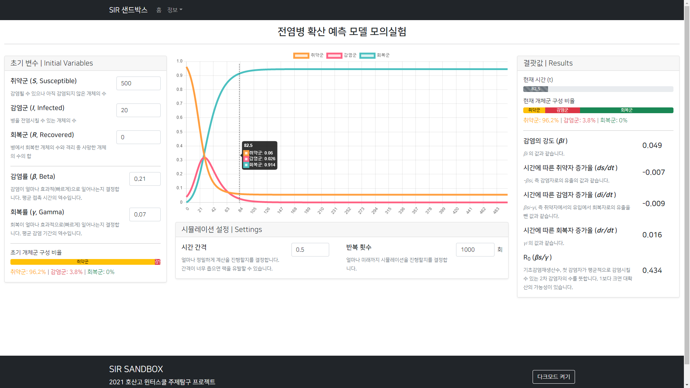

# SIR Sandbox

**질병 확산을 수학적으로 접근한 모델인 [SIR 모델](https://en.wikipedia.org/wiki/Compartmental_models_in_epidemiology#The_SIR_model)을 적용하여 간단히 제작한 전염병 확산 시뮬레이션 사이트입니다.**

[**이곳을 클릭하면**](https://sir.inft.kr) 사용해볼 수 있습니다.

## 라이선스
[라이선스](./LICENSE)는 GPLv3이 적용됩니다. 코드를 사용하실 때 반드시 출처를 밝혀주세요.
